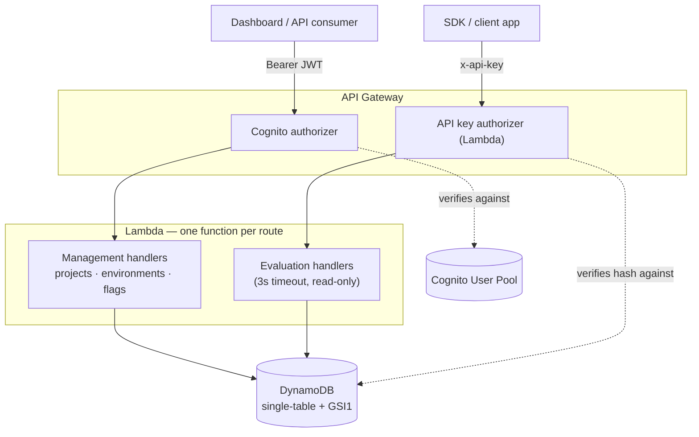

# FlagForge

A high-performance, real-time Feature Flag SaaS API built on AWS CDK,
TypeScript, API Gateway, Lambda, and DynamoDB.


**Status:** `v0.1.0` — MVP complete, feature-frozen for review.

**Demo video:**
**Release:** [v0.1.0](https://github.com/stvnpalma/flagforge/releases/tag/v0.1.0)

---

## What is FlagForge?

FlagForge is a serverless feature flag management API — the same category
of tool as LaunchDarkly or Unleash, scoped to a focused MVP: define
projects, spin up environments per project, create flags, and toggle each
flag independently per environment. A separate, hardened evaluation
endpoint lets client applications and SDKs ask "is this flag on?" in a
single fast, low-cost call.

It was built end-to-end — schema design, IAM, CI/CD, observability, and
auth — as a structured ticket-by-ticket project to demonstrate production
serverless patterns on AWS, not just "a Lambda that works."

## Architecture



Every Lambda is one file, one route, one IAM role scoped to the exact
DynamoDB actions it needs — no shared roles, no wildcard permissions.

## Engineering highlights

These are the decisions that separate this from a tutorial CRUD app:

| Decision                                           | Why                                                                                                                                                                                                                                            |
| -------------------------------------------------- | ---------------------------------------------------------------------------------------------------------------------------------------------------------------------------------------------------------------------------------------------- |
| **Single-table DynamoDB design**                   | All entities (`Project`, `Environment`, `Flag`, `FlagEnvironment`, `ApiKey`) share one table. Related data is fetched in one `Query`, not N+1 round trips across tables.                                                                       |
| **Flag definition ≠ flag state**                   | `FlagEntity` (rarely changes) and `FlagEnvironmentEntity` (toggled constantly, per environment) are separate items — so a write to one environment's state can never race with or overwrite another's.                                         |
| **`TransactWriteItems` for referential integrity** | DynamoDB has no foreign keys. Creating an environment or setting flag state runs an atomic condition-check + put — a flag can never be created under a deleted project, a state can never reference a flag or environment that doesn't exist.  |
| **Fail-open vs. fail-closed, applied correctly**   | Evaluation fails _open_ at the HTTP layer (unknown project/env → `200` + `{}`, never crashes a client) and fails _closed_ at the data layer (an unset flag defaults to `enabled: false`, so an unfinished feature can never ship by omission). |
| **Two-tier authentication**                        | Cognito JWT for human dashboard users (sessions, revocation per-person). Hashed, prefixed API keys (`ffk_…`) for embedded SDKs (long-lived, no login flow, leak-scannable prefix, never stored or logged in plaintext).                        |
| **Evaluation gets its own performance profile**    | A 3-second timeout and read-only IAM, separate from the 10-second management handlers — because this is the hot path every SDK polls.                                                                                                          |
| **Structured JSON logging + X-Ray**                | Every invocation logs `{ requestId, path, statusCode, durationMs }` as machine-parseable JSON, queryable in CloudWatch Insights. X-Ray traces every request end to end.                                                                        |
| **ARM_64 (Graviton2) everywhere**                  | ~20% cheaper, ~19% faster than x86 for identical Lambda workloads — a free win with no native-dependency cost.                                                                                                                                 |

## API reference

| Method | Route                                                           | Auth    | Description                               |
| ------ | --------------------------------------------------------------- | ------- | ----------------------------------------- |
| `POST` | `/projects`                                                     | Cognito | Create a project                          |
| `GET`  | `/projects`                                                     | Cognito | List projects                             |
| `GET`  | `/projects/{projectId}`                                         | Cognito | Get a project                             |
| `POST` | `/projects/{projectId}/environments`                            | Cognito | Create an environment                     |
| `GET`  | `/projects/{projectId}/environments`                            | Cognito | List environments                         |
| `POST` | `/projects/{projectId}/flags`                                   | Cognito | Create a flag definition                  |
| `GET`  | `/projects/{projectId}/flags`                                   | Cognito | List flag definitions                     |
| `GET`  | `/projects/{projectId}/flags/{flagKey}`                         | Cognito | Get a flag definition                     |
| `PUT`  | `/projects/{projectId}/flags/{flagKey}/environments/{envId}`    | Cognito | Set enabled/disabled state                |
| `GET`  | `/projects/{projectId}/flags/{flagKey}/environments/{envId}`    | Cognito | Read state                                |
| `POST` | `/projects/{projectId}/api-keys`                                | Cognito | Generate an evaluation API key            |
| `GET`  | `/projects/{projectId}/environments/{envId}/evaluate`           | API key | Evaluate **all** flags for an environment |
| `GET`  | `/projects/{projectId}/environments/{envId}/evaluate/{flagKey}` | API key | Evaluate **one** flag                     |

### Quick Start Evaluation (`curl`)

To instantly test evaluation routing using a generated `ffk_...` API key:

```bash
curl -H "x-api-key: ffk_your_api_key_here" \
 [https://09so7h4ql0.execute-api.us-east-1.amazonaws.com/prod/projects/](https://09so7h4ql0.execute-api.us-east-1.amazonaws.com/prod/projects/){projectId}/environments/{envId}/evaluate
```

Full request/response examples live in the Postman collection at
[`postman/flagforge.postman_collection.json`](./postman/flagforge.postman_collection.json).

## Tech stack

| Layer          | Choice                                                                 |
| -------------- | ---------------------------------------------------------------------- |
| Infrastructure | AWS CDK (TypeScript)                                                   |
| Compute        | AWS Lambda, Node.js 22, ARM_64                                         |
| API            | Amazon API Gateway (REST)                                              |
| Data           | Amazon DynamoDB (single-table, on-demand billing)                      |
| Auth           | Amazon Cognito (JWT) + SHA-256-hashed API keys                         |
| Observability  | CloudWatch Logs (30-day retention, structured JSON) + AWS X-Ray        |
| Testing        | Jest (unit, mocked AWS SDK) + Axios (integration, live deployed stack) |
| CI/CD          | GitHub Actions — lint → typecheck → test → `cdk synth` on every PR     |

## Getting started

### Prerequisites

| Tool        | Version                           |
| ----------- | --------------------------------- |
| Node.js     | >= 22.0.0                         |
| npm         | >= 10.0.0                         |
| AWS CDK CLI | >= 2.0.0                          |
| AWS CLI     | configured with valid credentials |

### Install and verify

```bash
npm ci
npm run lint
npm run typecheck
npm test
npx cdk synth --quiet
```

### Deploy

```bash
npx cdk deploy
```

CDK prints the API Gateway URL and Cognito identifiers as stack outputs.
Copy `.env.example` to `.env.local` and fill in `API_URL` and the
`COGNITO_*` values before running integration tests.

### Destroy

```bash
npx cdk destroy
```

> ⚠️ **Cost note:** this stack runs comfortably within AWS's always-free
> tier (DynamoDB on-demand, Lambda, API Gateway, Cognito's 50k MAU tier).
> Still — `cdk destroy` when you're done exploring, out of habit.

## Testing strategy

- **Unit tests** mock the DynamoDB client (`aws-sdk-mock`) and assert on
  service logic, validation utilities, and handler responses in
  isolation — no AWS calls, runs in CI on every PR.
- **Integration tests** use Axios against a live deployed stack,
  covering the full request lifecycle including both auth schemes
  (Cognito JWT and API key) across all three states: missing, invalid,
  and valid credentials.

```bash
npm test                 # unit tests, mocked
npm run test:coverage    # unit tests with coverage report
npm run test:integration # integration tests against API_URL in .env.local
```

Coverage threshold is enforced at 80% (branches, functions, lines,
statements) — a PR that drops below it fails CI.

## Project structure

```
flagforge/
├── .github/workflows/        # CI pipeline
├── bin/                      # CDK app entry point
├── lib/
│   ├── constructs/            # FlagForgeTable, FlagForgeApi, FlagForgeAuth,
│   │                          # FlagForgeFunction (Lambda factory)
│   └── flagforge-stack.ts
├── src/
│   ├── handlers/              # one file per route: projects/ environments/
│   │                          # flags/ evaluation/ apikeys/ auth/
│   ├── services/               # DynamoDB access, one file per domain
│   ├── types/                  # entities, API shapes, error hierarchy
│   └── utils/                   # http, validation, logger, dynamo client
├── test/
│   ├── handlers/ services/ utils/ constructs/   # unit tests
│   ├── integration/                              # Axios + live stack
│   └── setup/                                    # auth/apiClient helpers
└── postman/                  # API collection
```

## Git workflow

```
main        ← production, branch-protected, tagged with semantic versions
dev         ← integration branch, all PRs land here first
feature/*   ← new work, branched from dev
bugfix/*    ← bug fixes, branched from dev
release/*   ← version/changelog prep only, never code changes
```

**Commit convention:** `feat:` `fix:` `chore:` `test:` `docs:` `refactor:`

**CI/CD:** every PR targeting `dev` or `main` runs lint → typecheck →
unit tests → `cdk synth` via GitHub Actions. `main` requires a passing
PR and cannot be pushed to directly.

## Roadmap

`v0.1.0` is the complete MVP and the intentional stopping point for this
phase — the codebase is frozen here for review. Ideas under
consideration for a `v0.2.0`, not yet started:

- Flag targeting rules (user/segment-based rollout)
- Percentage-based gradual rollouts
- A small observability dashboard over the CloudWatch/X-Ray data
- A published SDK client wrapping the evaluation endpoints

## License

## License

This project is licensed under the MIT License - see the [LICENSE](./LICENSE) file for details.
